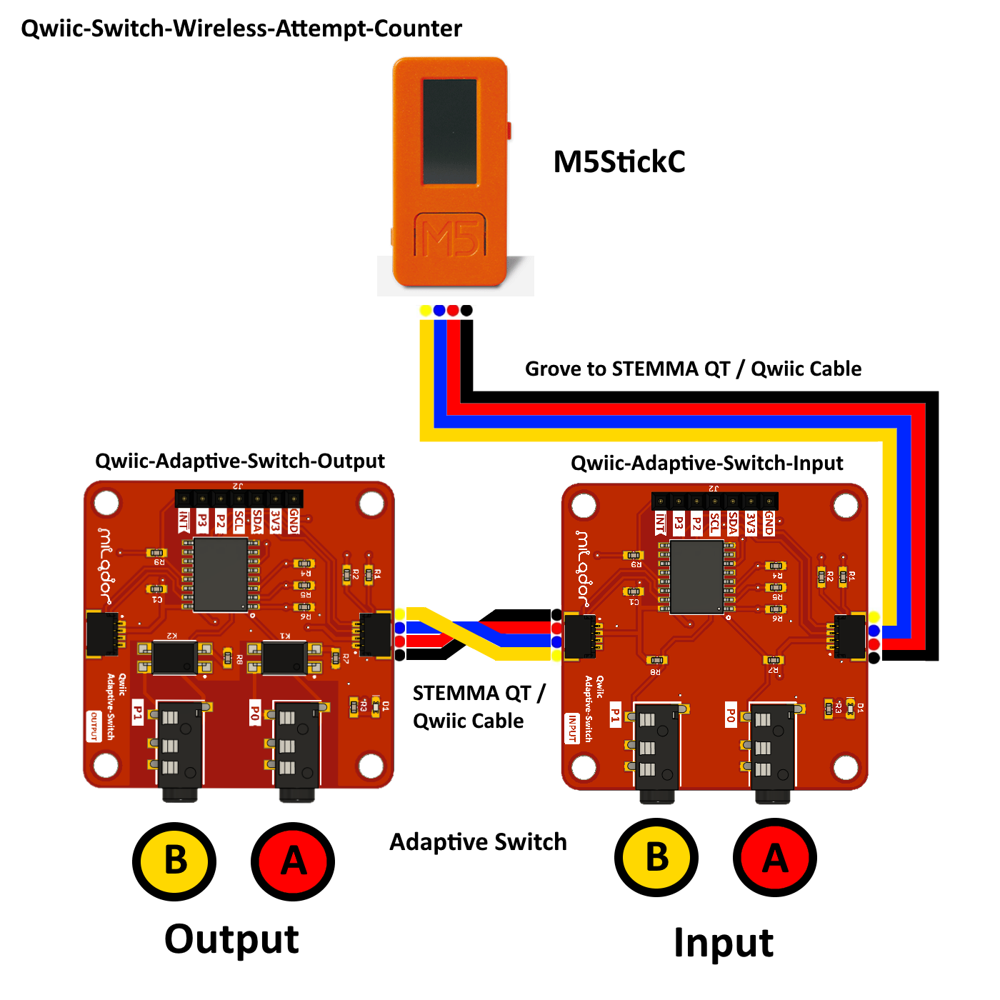

# Hardware

## Hardware requirements  

### Components to be purchased

  1. [Qwiic-Adaptive-Switch-Input](https://github.com/milador/Qwiic-Adaptive-Switch) x 1
  2. [Qwiic-Adaptive-Switch-Output](https://github.com/milador/Qwiic-Adaptive-Switch) x 1
  3. [M5StickC ESP32-PICO Mini IoT Development Kit](https://shop.m5stack.com/products/stick-c?variant=17203451265114) x 1
  4. [STEMMA QT / Qwiic JST SH 4-Pin Cable](https://www.adafruit.com/product/4399) x 1
  5. [Grove to STEMMA QT Cable](https://www.adafruit.com/product/4528) x 1  
  6. Micro USB C Male to USB A Male cable x 1
  7. Micro SD Card x 1 (Optional)
  
### Components to be prepared

  1. Download the required 3D printable support or enclosure files [3D-Print](./3D-Print/)
  2. Generate the G-Code of the provided files using the slicer of your choice
  3. 3D print the required support or enclosure parts using generated G-Code

## Hardware Assembly Instructions

  1. Take [Grove to STEMMA QT Cable](https://www.adafruit.com/product/4528)
  2. Connect the Grove end of [Grove to STEMMA QT Cable](https://www.adafruit.com/product/4528) to the Grove connector of [M5StickC](https://shop.m5stack.com/products/stick-c?variant=17203451265114)
  3. Connect the Qwiic end of [Grove to STEMMA QT Cable](https://www.adafruit.com/product/4528) to the STEMMA connector of [Qwiic-Adaptive-Switch-Input](https://github.com/milador/Qwiic-Adaptive-Switch).
  4. Take [STEMMA QT / Qwiic JST SH 4-Pin Cable](https://www.adafruit.com/product/4399)
  5. Connect one end of the [STEMMA QT / Qwiic JST SH 4-Pin Cable](https://www.adafruit.com/product/4399) to the other STEMMA connector of [Qwiic-Adaptive-Switch-Input](https://github.com/milador/Qwiic-Adaptive-Switch).
  6. Connect one other end of the [STEMMA QT / Qwiic JST SH 4-Pin Cable](https://www.adafruit.com/product/4399) to the reminding STEMMA connector of [Qwiic-Adaptive-Switch-Output](https://github.com/milador/Qwiic-Adaptive-Switch).
  
  
  

